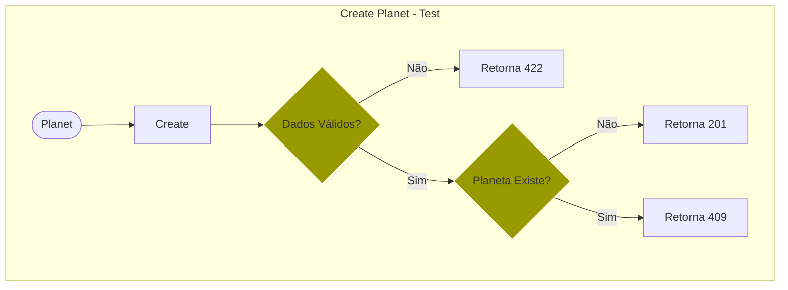

# Cenários de Testes

```mermaid

flowchart TB
    classDef done fill:#009900,stroke:#ffffff
    classDef todo fill:#990000,stroke:#ffffff
    classDef in_progress fill:#999900,stroke:#ffffff


    subgraph Create Planet - Test
        Planet([Planet])
        Create[Create]
        DadosVálidos{Dados Válidos?}:::in_progress
        PlanetaExiste{Planeta Existe?}:::in_progress
        422[Retorna 422]
        201[Retorna 201]
        409[Retorna 409]


     %%   Faq[FAQ]:::in_progress
    %%    UsuarioCliente[Usuário/Cliente]
    %%    ContaFinanceira[Conta Financeira]
    %%    TransacaoFinanceira[Transação Financeira]
    %%    CategoriaDespesaReceita[Categoria de Despesa/Receita]
    %%    OrcamentoMensal[Orçamento Mensal]
    %%    MetasFinanceiras[Metas Financeiras]
    %%    Investimentos[Investimentos]
    %%    FundosEmergencia[Fundos de Emergência]
    %%    NotificacoesLembretes[Notificações e Lembretes]
    %%    ConfiguracoesUsuario[Configurações do Usuário]
    end

    Planet --> Create --> DadosVálidos -- Não --> 422
    DadosVálidos -- Sim --> PlanetaExiste -- Sim --> 409
    PlanetaExiste -- Não --> 201
```
